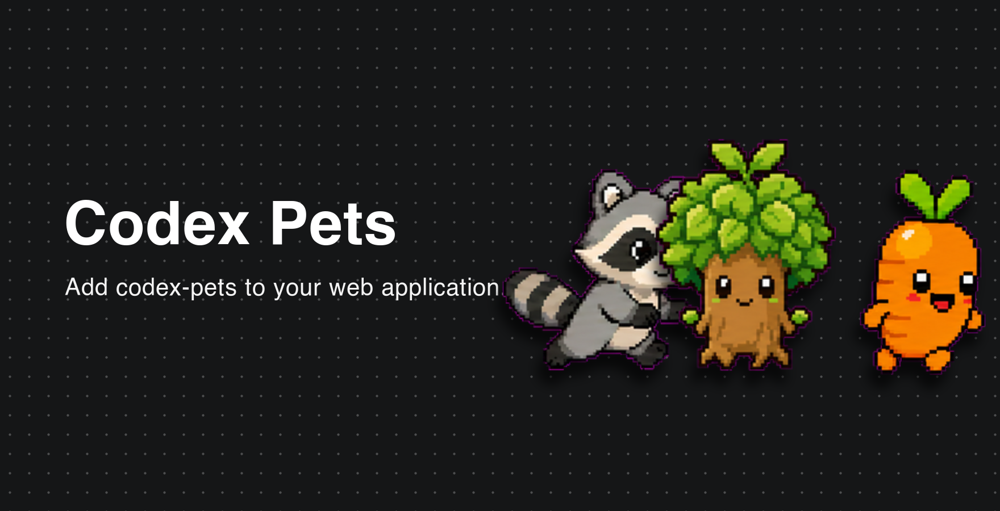

# Codex Pets Web



Render Codex pet spritesheets in web products. The core package is plain
TypeScript with no runtime dependencies; framework packages wrap the same
engine for product teams that use React today and other frameworks later.

## Packages

- `codex-pet-web`: dependency-free DOM renderer, animator, drag controller, and
  bundled example pet assets.
- `codex-pet-web-react`: React wrapper around `codex-pet-web`.
- `apps/demo`: local playground used by this repository.

## Install

React product:

```bash
npm install codex-pet-web codex-pet-web-react
```

Framework-neutral DOM usage:

```bash
npm install codex-pet-web
```

## Quick Start: React

```tsx
import { CodexPet } from "codex-pet-web-react";

export function AssistantPet() {
  return (
    <CodexPet
      aria-label="Assistant pet"
      draggable
      floating={{ x: 24, y: 24, zIndex: 1000 }}
      fps={8}
      scale={0.5}
      spritesheetUrl="/codex-pets/sapling/spritesheet.webp"
      stateFps={{ idle: 2, waiting: 3 }}
    />
  );
}
```

## Quick Start: Core DOM

```ts
import { createCodexPetElement } from "codex-pet-web";

const { element, animator } = createCodexPetElement({
  ariaLabel: "Assistant pet",
  draggable: true,
  floating: { x: 24, y: 24, zIndex: 1000 },
  scale: 0.5,
  spritesheetUrl: "/codex-pets/sapling/spritesheet.webp",
  stateFps: { idle: 2, waiting: 3 }
});

document.body.append(element);
animator.play("waving", { loops: 1 });
```

## Add Pet Assets

The renderer expects a public URL to a Codex spritesheet. If you want to use the
bundled example pets, copy them into your app's public assets:

```bash
mkdir -p public/codex-pets
cp -R node_modules/codex-pet-web/example-pets/* public/codex-pets/
```

The bundled examples are:

- `sapling`: tree companion
- `carrot`: carrot companion
- `bandit`: raccoon companion

You can also import their typed metadata:

```ts
import { CODEX_PET_EXAMPLES } from "codex-pet-web";

const sapling = CODEX_PET_EXAMPLES.find((pet) => pet.id === "sapling");
```

`manifestPath` and `spritesheetPath` are package-relative paths. Convert them to
public URLs based on where your app copies the assets.

## Interactions

Use persistent state for the pet's normal mood or activity:

```tsx
<CodexPet state={isWorking ? "running" : "idle"} />
```

Use a ref for temporary actions:

```tsx
pet.current?.play("jumping", { loops: 1 });
pet.current?.setState("running", { interrupt: true });
```

`floating` fixes the pet to the viewport. `draggable` lets users move it around.
During drag, horizontal movement switches to `running-left` or `running-right`;
on release, the pet plays one `jumping` loop and returns to its previous base
state.

## Sprite Contract

Codex pets are regular folders:

```text
<pet-id>/
├── pet.json
└── spritesheet.webp
```

Spritesheets use the fixed Codex atlas:

- `1536x1872`
- `8` columns x `9` rows
- `192x208` cells
- transparent background
- unused cells fully transparent

States are mapped by row:

| State | Row | Frames |
| --- | ---: | ---: |
| `idle` | 0 | 6 |
| `running-right` | 1 | 8 |
| `running-left` | 2 | 8 |
| `waving` | 3 | 4 |
| `jumping` | 4 | 5 |
| `failed` | 5 | 8 |
| `waiting` | 6 | 6 |
| `running` | 7 | 6 |
| `review` | 8 | 6 |

## Production Notes

- The packages are ESM-only and ship TypeScript declarations.
- The core renderer has no runtime dependencies.
- React is a peer dependency of `codex-pet-web-react`.
- Animation uses one shared scheduler across all pets.
- Pets are decorative by default; pass `aria-label` when the pet communicates
  meaningful product state.
- Bundled example assets are useful for demos and defaults. Product-specific
  pets should be copied or hosted by your app like other static assets.

## Repository Development

```bash
npm install
npm run copy:pets
npm run dev
```

`copy:pets` copies local pets from `~/.codex/pets` into the demo. Production
demo builds copy the bundled example pets from `packages/core/example-pets`.

Before publishing:

```bash
npm run typecheck
npm run test
npm run build
npm run pack:dry
```

The latest release line is `0.2.x`.
